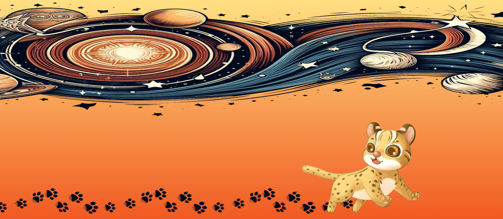

## 畫面

> 可提供 1~3 張圖片，讓觀看者透過 README 了解整體畫面

## 專案技術

- html v5
- css
- javascript
- jQuery
- bootstrap v5.3
- ajax
- Animate.css
- wow.js
- slick
- parallax
- fontawesome

## 功能簡介

此專案嘗試使用視差效果製作玩具商品網頁：

- 首頁有投影輪播功能 
- 具有會員註冊及登入功能
- 精選商品可以拉動選擇(slick)
- 頁尾按鈕可回頁首

